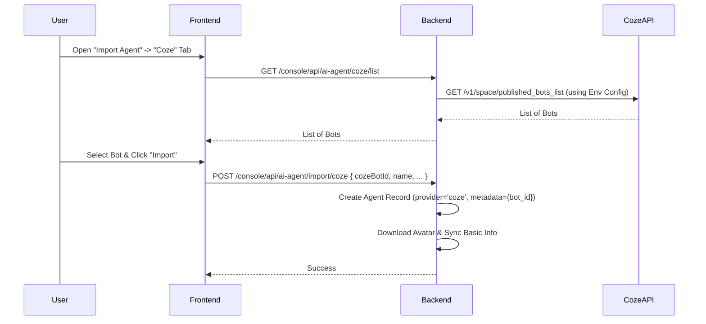
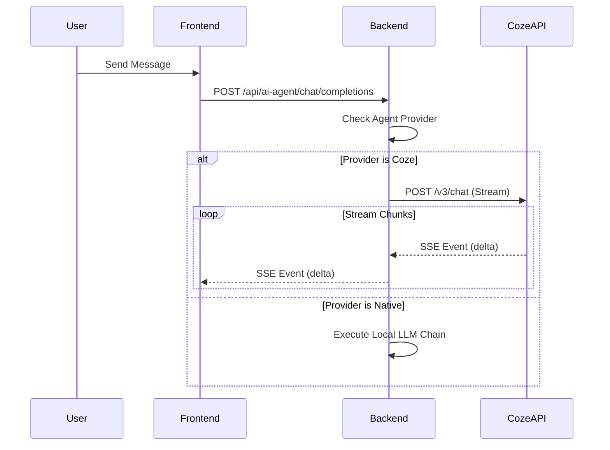

# Design: Import Coze Agent

## Architecture

The integration consists of two parts: **Management (Import)** and **Runtime (Chat)**.

### Management Flow (Import)

### Runtime Flow (Chat)

## Configuration

The backend requires the following environment variables:
- `COZE_API_BASE`: Base URL for Coze API (e.g., `https://api.coze.cn`).
- `COZE_API_TOKEN`: Personal Access Token or OAuth Token.
- `COZE_SPACE_ID`: The specific Space ID to list bots from.

## Data Mapping

When importing, we map basic metadata for display purposes. The execution logic resides in Coze.

| Coze Field | BuildingAI Field | Notes |
| :--- | :--- | :--- |
| `bot_id` | `thirdPartyIntegration.coze.botId` | Stored in JSON metadata/config. |
| `bot_name` | `name` | |
| `description` | `description` | |
| `icon_url` | `avatar` | Downloaded to local storage. |
| - | `model` | Set to a placeholder like `coze-proxy`. |
| - | `prompt` | Not synced (hidden or read-only), as it lives in Coze. |

## Chat Implementation Details

- **Session Management**: Coze requires a `conversation_id` and `user_id`.
    - `user_id`: Map from BuildingAI User ID.
    - `conversation_id`: Map from BuildingAI Chat Session ID.
- **Streaming**: Coze returns SSE events (`conversation.message.delta`, `conversation.message.completed`). We need to parse these and convert them to BuildingAI's standard SSE format to ensure the frontend renders correctly without changes.
- **Inputs**: Coze bots might require additional inputs. For MVP, we map the user's message to the primary input.

## Security

- **Token Storage**: The `COZE_API_TOKEN` is stored in the backend environment, not exposed to the frontend.
- **Access Control**: Only admins or authorized users should be able to list and import bots from the organization's Coze space.
